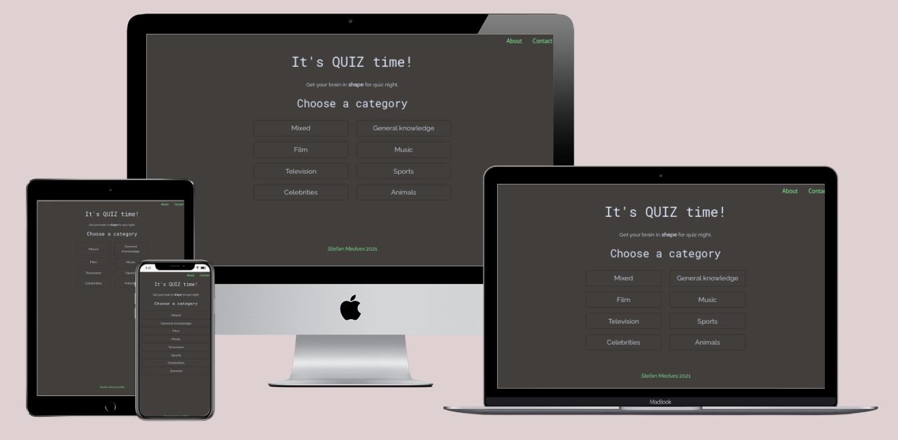
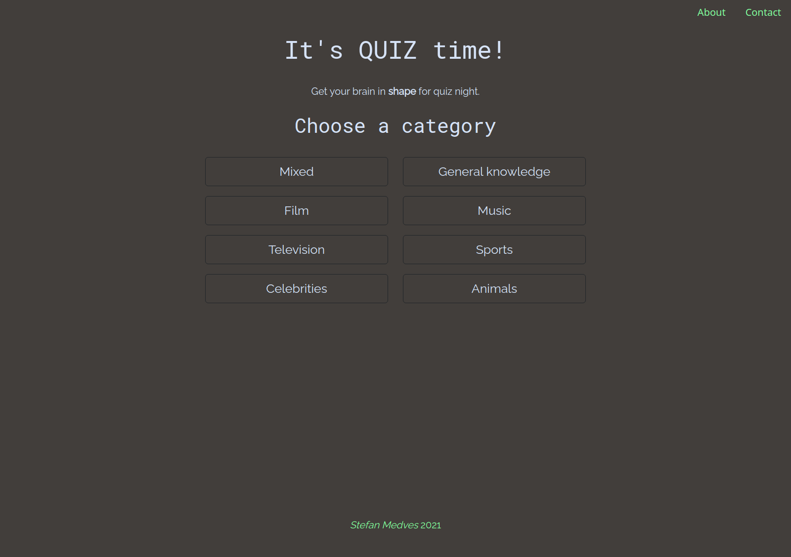
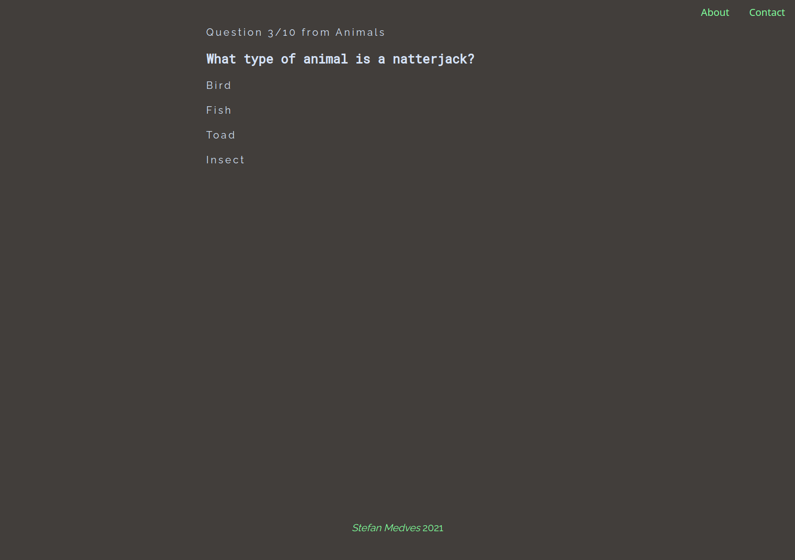
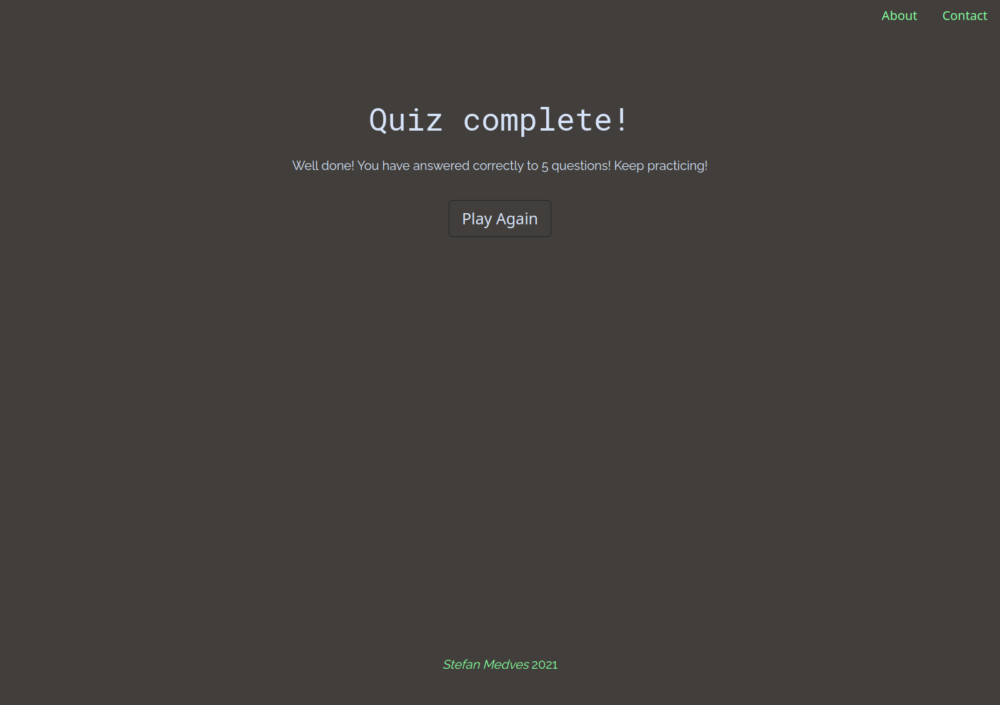

## **Table of contents**
[**1. Name**](#1-project's-name)

[**2. Purpose**](#2-purpose) 

[**3. UX**](#3-ux)
- [3.1 User stories](#31-user-stories)
- [3.2 Structure](#32-structure)
- [3.3 Design](#33-design)  
  - [3.3.1 Colour scheme](#331-colour-scheme)
  - [3.3.2 Typography](#332-typography)
  - [3.3.3 Wireframes](#333-wireframes)

[**4. Features** ](#4-features)
- [4.1 Existing features](#41-existing-features)
- [4.2 Features left to implement](#42-features-left-to-implement)

[**5. Technologies used**](#5-technologies-used)

[**6. Testing**](#6-testing)
- [6.1 Online validators](#61-online-validators)
- [6.2 User stories testing](#62-user-stories-testing)
- [6.3 Bugs](#63-bugs)
- [6.4 Performance](#64-performance)

[**7. Deployment and cloning**](#7-deployment-and-cloning)
- [7.1 Deployment](#71-deployment)
- [7.2 Cloning](#72-cloning)

[**8. Credits**](#8-credits)
- [8.1 Code](#81-code)
- [8.2 Media](#82-media)
- [8.3 Acknowledgements](#83-acknowledgements)

# 1. Project's Name
The project's name is **Quiz Time** and it was created using Front end technologies only. The live website can be found [here](https://stefanmdvs.github.io/quiz-codeInstitute/index.html). 

# 2. Purpose
The project was created as part of my journey with Code Institute for the Milestone 2 project. The purpose was to implement the front end technologies learned and create a website focused on user interaction. 

# 3. UX
## 3.1 User stories
1. User can intuitevely navigate across the website;
2. User can choose a category they want to play;
3. User can see their quiz progress;
4. User can see how they were doing at the end;
5. User can contact the developer.
## 3.2 Structure
The website contains the landing page where user can choose a category they wish to play, the *About* section containing information about the game, and the *Contact* page where user can fill in a contact form.  

## 3.3 Design
### 3.3.1 Colour scheme
I have started from the dark grey color as a background and from there I chose a light grey/blue colour for the text. For the navigation links and footer I went for a strong green, the same colour being used as border colour on hover over buttons.
### 3.3.2 Typography
The project uses two different Google fonts families, *Roboto mono* for headers  and *Raleway* for paragraphs, navigation and buttons.
### 3.3.3 Wireframes
Wireframes are available for each section and different screen sizes. Full size wireframes can be accessed as follows:
* [mobile view of home, game mode and end-game page](assets/wireframes/mobileView-home-game-end.pdf)
* [mobile view of the contact page](assets/wireframes/mobileContact.pdf)
* [tablet view of Home and game page](assets/wireframes/tabletView-home-game.pdf)
* [tablet view of end game page](assets/wireframes/tabletView-end.pdf)
* [tablet view of Contact page](assets/wireframes/tabletContact.pdf)
* [desktop view of Home page](assets/wireframes/desktop-home.pdf)
* [desktop view of game page](assets/wireframes/desktop-game.pdf)
* [desktop view of end game page](assets/wireframes/desktop-end.pdf)
* [desktop view of Contact page](assets/wireframes/desktopContact.pdf).
# 4. Features
## 4.1 Existing features
The project consists of:
- Landing page
- Game section
- End game page
- Contact page.

The *landing* page contains the project title and a call to action to choose a category to play. Also here user can click the *About* button and a modal pops up with a short info about the quiz. 

 The user can choose one category to play and then the quiz game begins. The *game* section loads the questions and answers from the chosen category and the user needs to select an answer before moving on to the next question. If their selection is the right one, the answer highlights in green, otherwise it highlights in red.

At the end of the quiz, the user is presented with the number of questions they got right and a call to action button inviting them to play again.  

The *Contact* page contains a contact form which allows user to send an email using client-side technology only.
## 4.2 Features left to implement
One of the features I wish to implement in the future is adding the option to choose the **difficulty** of the questions, as the API used has 3 difficulty levels. For the time being the game loads the *medium* level, but I think it would increase the user experience if the other two categories were available to choose from.  
Another feature I wish to add is a **timer** to keep track of how long it takes for the user to finish the quiz.  
To further enhance the user experience I would also add a **leaderboard** holding names and scores of the players.
# 5. Technologies used
The project was built using:
- HTML
- CSS
- Javascript.

In addition I have also used the following:
- [Bootstrap](https://getbootstrap.com/) to build a responsive website
- [Google fonts](https://fonts.google.com/), for the main two font families
- [Balsamiq](https://balsamiq.com/) used to create the project's wireframes
- [Coolors](https://coolors.co/) to help match the color palette
- [Favicon](https://favicon.io/) for generating the favicon image 
- [Mockup generator](http://techsini.com/multi-mockup/index.php) used to generate the mockup of the project
- [HTML validator](https://validator.w3.org/) used to check for errors in html files
- [CSS validator](https://jigsaw.w3.org/css-validator/) used to check for errors in stylesheet
- [JS hint](https://jshint.com/) used to check the quality of JS code.

# 6. Testing
## 6.1 Online validators
The project's source code was tested by file upload using [W3C HTML Validator](https://validator.w3.org/) and [CSS Validator](https://jigsaw.w3.org/css-validator/) and no errors are returned. However, when testing by URI, the report throws 17 errors associated with Bootstrap CDN. Full size pictures of the tests can be found here:
- [HTML Validator](assets/testing/html-validator.png)
- [CSS Validator (success)](assets/testing/css-validator.png)
- [CSS Validator (errors)](assets/testing/errors-bootstrap.png)
- [JS code check](assets/testing/js-validator.png)  

After using JShint tool, a few missing semicolons were added to the code.

## 6.2 User stories testing
The site was tested across: Google Chrome, Samsung Internet and Amazon Silk web browser. The testing process followed the user stories:
>User can intuitevely navigate across the website
>
Website is intuitive, links send user to the right page.
>User can choose a category they want to play
>
Buttons work and load the right category of questions.
>User can see their quiz progress
>
After each selected answer, the counting is increasing and user can see how further down the quiz they are.
>User can see how they were doing at the end
>
End game page is loading and the correct number of questions is being displayed. Also the call to action button sends the user back on the main page where a different category can be chosen.
>User can contact the developer
>
After filling in the contact form, the message is being sent over to the developer using EmailJS. Fields reset after successfully sending the message.  

## 6.3 Bugs
While testing I have discovered the following bug: user could click on multiple answers and the questions displayed would skip according to the number of clicks. For example, if 2 answers were selected the question display would skip 2 questions.  
The bug was fixed by adding a variable to check if the user has answered and set it to false while the user made their current selection. 

## 6.4 Performance 
I have used Lighthouse for testing the performance of the website and after adding the meta tags the report for mobile testing shows scores of 90 and above. The desktop testing report shows the SEO at 89. The full size reports can be found here:
- [Lighthouse mobile test report](assets/testing/lighthouse-mobile.pdf)
- [Lighthouse desktop test report](assets/testing/lighthouse-desktop.pdf)  

# 7. Deployment and cloning
## 7.1 Deployment
The project used the [Code Institute's template](https://github.com/Code-Institute-Org/gitpod-full-template) to create a GitHub repository, all other code was created in Visual Studio Code locally and pushed into GitHub using the Terminal and the following commands:  
- ```git clone```, to clone the gitHub repository; 
- ```git add```, to stage files to be commited;
- ```git push```, to upload content. 

The deployment was done using GitHub pages, following these steps:  

1. Under the "Settings" tab, I scrolled down to GitHub Pages;
2. The "Master Branch" was selected next from the drop-down;
3. After pressing "Save", the site was published online.  

## 7.2 Cloning
The project can be run locally either by cloning or by downloading it, following these steps:  
To clone the project:

1. Click on the "Code" button and select how to clone it: using HTTPS, SSH or GitHub CLI;
2. Click on the copy icon to the right
3. From a terminal window, change to the local directory where you want to clone your repository
4. Use ```git clone``` and paste in the command you copied before.  

If the command was succsessfull, a new subfolder should appear having the same name as the repository cloned.  
To download the project:

1. Click on the "Code" button
2. Select "Download ZIP" and your chosen folder on your local machine
3. Unzip it locally.

# 8. Credits
## 8.1 Code
The project was built following the tutorials of [James Q Quick](https://www.youtube.com/playlist?list=PLDlWc9AfQBfZIkdVaOQXi1tizJeNJipEx) on YouTube, mostly following the same structure. I have chosen to work with classes which unlike the original code required some adjustments in structure.
## 8.2 Media
The image used to generate the favicon was created be [Vectors Market](https://www.flaticon.com/authors/vectors-market) for [flaticon.com](https://www.flaticon.com/).
## 8.3 Acknowledgements
I owe a massive "Thank you" to my friend Marcel, who as a developer guided me to succsesfully get this project up and running.  
I am also grateful for my mentor's input, Spencer Barriball, for the guidance, encouragements and supportive attitude.